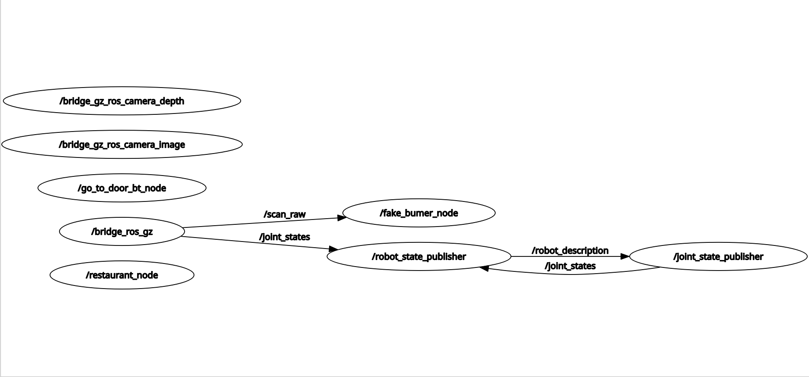

# PFA_RESTAURANTE

# Overview

## Computation Graph
[Aquí deberíamos añadir el Computation Graph después de la descripción]


## BT


# Resumen
La idea principal es la implementación de un acomodador de un restaurante.

El kobuki irá desde su posición inicial al punto de entrada, donde se encontrará una cantidad
X de personas. Ahí, kobuki preguntará cuántos son y mediante un input se especificará 
el número de personas a acomodar.

# Detalles Técnicos

## Mapa


**Posiciones usadas:** Inicial, Recibidor, mesa BIG (6 personas), mesa SMALL (4 personas)

## Especificaciones de lógica

Si la cantidad de personas es superior a 6, el kobuki dirá que no hay
mesas disponibles.

Si la mesa de 4 personas está libre y llega un grupo de 6, el kobuki ha de 
detectar que el grupo es demasiado grande y que no hay sitio, asimismo, elige la
mesa más óptima según el número de personas para sentar, por lo que si llega un
grupo de 2 personas y la mesa de 6 está libre, pero no la de 4 el programa les 
dice que no hay mesas disponibles y espera a un grupo más grande.


# Uso

**Kobuki**
```
ros2 launch kobuki kobuki.launch.py lidar_a2:=true
```

**Navegation**.
```
ros2 launch kobuki navigation.launch.py
```
Gracias a este comando también se abre el rviz2 con el que se puede visualizar el mapa por el que se mueve el kobuki.
```
ros2 run tf2_ros tf2_echo map base_link
```
El proceso que seguimos fue señalizar con el rivz2 las coordenadas que queríamos guardar en el blackboard, haciendo este ros2 run para poder visualizar las coordenadas exactas de los lugares a los que queremos mandar el robot.

**Nodo**
```
ros2 run pfa_restaurante control_main
```

**Paquete de Festival para la implementación de voz**
```
sudo apt update
sudo apt install festival festvox-kallpc16k ## Para la voz en inglés
sudo apt install festvox-ellpc11k ##Para añadir la voz en Español (latino)

```

# Apuntes
Se quería implementar en un principo el uso del HRI, de hecho a llegado a estar
parcialmente funcional (escuchaba pero no se procesaba lo que se decía, el
speak hacía cosas raras pero compilaba...) en distintos puntos de la implementación,
pero por falta de tiempo no se ha podido terminar, y preferimos un código 
funcional con menos cosas que uno con más cosas que funcione peor.

Para sustituir la falta de un elemento del hri (listen, queary, speak), hemos 
usado el paquete Festival para implementar una voz que hace preguntas y comentarios
al usuario, no es lo mismo, ni es tan complejo como nos gustaría, pero es mejor
que nada.

Otra idea a implementar, que por falta de tiempo no ha sido posible es que si 
llegan clientes nuevos y no hay una mesa disponible, va a la mesa más óptima 
y les pide que se vayan, la marca vacía (asumimos que los clientes han hecho caso) 
y vuelve a donde se encuentran los nuevos clientes para llevarles a la nueva mesa vacía.


## Video de implementación básica
[](https://www.youtube.com/watch?v=4J1Ffc5u-C8)


**FECHA:** 9/5/2024 

**AUTORES:**
  MarioC05 (Mario Casero)
  rumbahuh (Rebeca Castilla)
  inarem13/inarem-jpg (Henar Contreras)
  LoVeMi3 (Lorea Vera)
